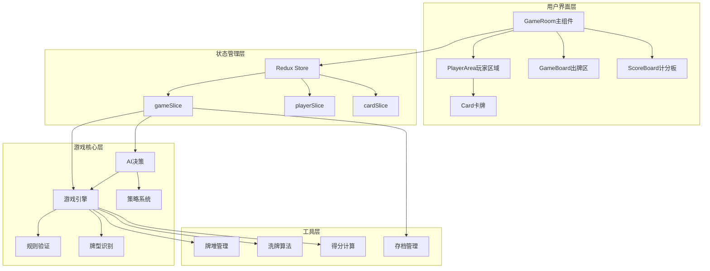
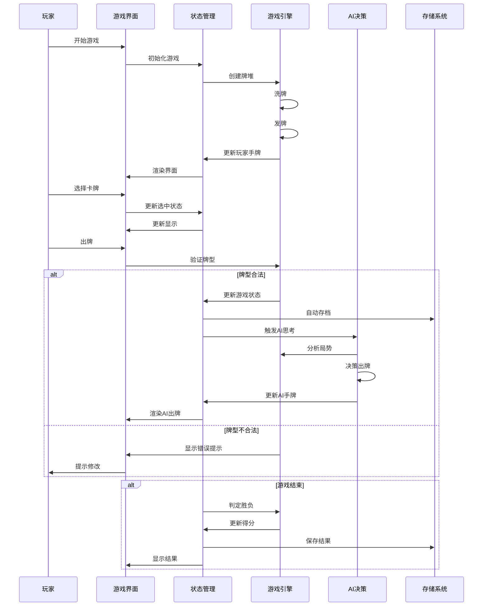
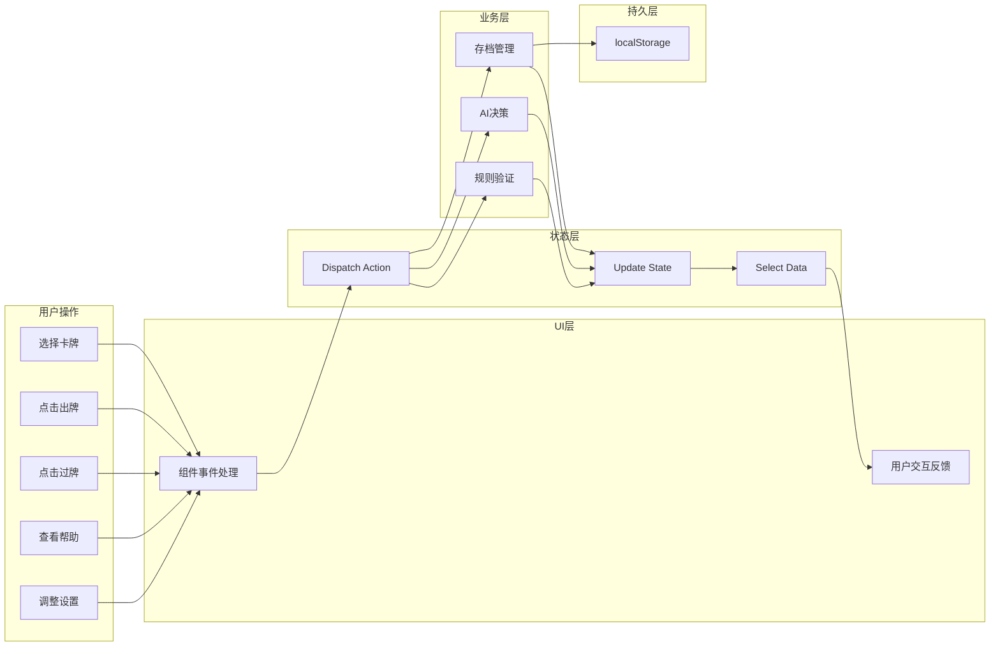

# 掼蛋纸牌游戏架构文档

## 概述

掼蛋纸牌游戏是一个单机版网页应用,支持1个人类玩家对战3个AI对手。游戏使用两副扑克牌(共108张),分为两队对抗,每队2人。系统实现了完整的掼蛋游戏规则,包括发牌、进贡、出牌、胜负判定等功能,同时提供流畅的卡牌动画效果和友好的用户界面。

**目标用户**: 掼蛋游戏爱好者、想要学习掼蛋规则的新手玩家、休闲娱乐用户

**核心能力**:
- 实现完整的掼蛋游戏规则,包括多种牌型识别和比较
- 提供3个AI对手,具有基本的游戏策略和状态记忆能力
- 支持游戏存档和读档功能,使用localStorage存储
- 提供详细的游戏帮助和规则说明系统
- 具备流畅的卡牌动画效果和音效反馈

**关键架构特征**:
- 单机模式,所有游戏逻辑在浏览器端运行
- 使用Redux Toolkit管理全局游戏状态
- 采用React组件化开发模式
- 使用Framer Motion实现流畅的卡牌动画
- 支持响应式设计,适配桌面和移动端

## 技术栈

**语言与运行时**
- TypeScript 5.x
- React 18+

**框架与库**
- React 18+ - 前端UI框架
- Redux Toolkit - 全局状态管理
- Framer Motion - 动画效果库
- Material-UI (MUI) - UI组件库
- Vite - 构建工具和开发服务器

**测试框架**
- Vitest - 单元测试框架
- React Testing Library - 组件测试
- Playwright - 端到端测试

**数据存储**
- localStorage - 游戏存档
- IndexedDB (可选) - 大量数据存储

**开发工具**
- ESLint - 代码检查
- Prettier - 代码格式化
- TypeScript - 类型检查

## 项目结构

```
guandan-card-game/
├── src/
│   ├── components/          # React组件
│   │   ├── GameRoom/        # 游戏房间组件
│   │   │   ├── index.tsx
│   │   │   ├── GameBoard.tsx
│   │   │   ├── PlayerArea.tsx
│   │   │   └── ScoreBoard.tsx
│   │   ├── Card/            # 卡牌组件
│   │   │   ├── index.tsx
│   │   │   └── CardBack.tsx
│   │   ├── Help/            # 帮助系统组件
│   │   │   ├── index.tsx
│   │   │   ├── HelpModal.tsx
│   │   │   └── RuleSection.tsx
│   │   └── Settings/        # 设置组件
│   │       ├── index.tsx
│   │       └── SettingsMenu.tsx
│   ├── store/               # Redux状态管理
│   │   ├── index.ts
│   │   ├── gameSlice.ts
│   │   ├── playerSlice.ts
│   │   └── cardSlice.ts
│   ├── game/                # 游戏核心逻辑
│   │   ├── engine/          # 规则引擎
│   │   │   ├── rules.ts
│   │   │   ├── cardTypes.ts
│   │   │   └── validator.ts
│   │   ├── ai/              # AI决策系统
│   │   │   ├── decision.ts
│   │   │   └── strategy.ts
│   │   ├── utils/           # 工具函数
│   │   │   ├── deck.ts
│   │   │   ├── shuffle.ts
│   │   │   └── scoring.ts
│   │   └── constants.ts     # 常量定义
│   ├── hooks/               # React Hooks
│   │   ├── useGame.ts
│   │   └── useAnimation.ts
│   ├── types/               # TypeScript类型定义
│   │   ├── card.ts
│   │   ├── player.ts
│   │   └── game.ts
│   ├── utils/               # 通用工具
│   │   └── storage.ts
│   ├── App.tsx              # 应用主组件
│   └── main.tsx             # 应用入口
├── public/                  # 静态资源
│   ├── images/
│   └── sounds/
├── tests/                   # 测试文件
│   ├── unit/
│   ├── integration/
│   └── e2e/
├── .monkeycode/             # 项目文档
│   └── docs/
├── index.html
├── package.json
├── tsconfig.json
└── vite.config.ts
```

**入口点**
- `src/main.tsx` - 应用启动入口
- `src/App.tsx` - 主应用组件
- `src/store/index.ts` - Redux store配置

## 子系统

### 游戏引擎 (Game Engine)
**目的**: 实现掼蛋游戏的核心规则和逻辑
**位置**: `src/game/engine/`
**关键文件**: `rules.ts`, `validator.ts`, `cardTypes.ts`
**依赖**: `src/types/`, `src/game/utils/`
**被依赖**: `src/store/`, `src/game/ai/`

### AI决策系统 (AI System)
**目的**: 为3个AI玩家提供决策逻辑和策略
**位置**: `src/game/ai/`
**关键文件**: `decision.ts`, `strategy.ts`
**依赖**: `src/game/engine/`, `src/types/`
**被依赖**: `src/store/`

### 状态管理 (State Management)
**目的**: 管理全局游戏状态,协调组件间通信
**位置**: `src/store/`
**关键文件**: `gameSlice.ts`, `playerSlice.ts`, `cardSlice.ts`
**依赖**: `src/game/engine/`, `src/types/`
**被依赖**: `src/components/`

### UI组件层 (UI Components)
**目的**: 渲染游戏界面,处理用户交互
**位置**: `src/components/`
**关键文件**: `GameRoom/index.tsx`, `PlayerArea.tsx`, `Card/index.tsx`
**依赖**: `src/store/`, `src/types/`, `src/hooks/`
**被依赖**: `src/App.tsx`

### 帮助系统 (Help System)
**目的**: 提供游戏规则说明和教程
**位置**: `src/components/Help/`
**关键文件**: `HelpModal.tsx`, `RuleSection.tsx`
**依赖**: 无外部依赖
**被依赖**: `src/components/GameRoom/`

## 系统架构图



## 游戏流程图



## 数据流图



## 关键技术决策

### 1. 选择Redux Toolkit作为状态管理
**理由**:
- 游戏状态复杂,涉及多个玩家、卡牌、回合等信息
- Redux提供可预测的状态管理,便于调试
- Redux Toolkit简化了Redux的样板代码
- 支持时间旅行调试,便于问题排查

### 2. 使用Framer Motion实现动画
**理由**:
- 提供声明式动画API,易于使用
- 性能优秀,支持GPU加速
- 与React集成良好
- 支持复杂动画编排

### 3. 单机模式设计
**理由**:
- 降低开发和部署复杂度
- 无需服务器,减少成本
- 响应速度快,用户体验好
- 使用localStorage存档,数据安全

### 4. AI策略系统
**理由**:
- 实现基本游戏策略,提供合理对手
- 状态记忆机制,提升AI智能度
- 固定中等难度,平衡游戏性
- 决策时间可控,不阻塞游戏

## 性能考虑

### 渲染性能
- 使用React.memo优化组件重渲染
- 卡牌组件使用虚拟滚动(如需要)
- 动画使用transform和opacity属性(触发GPU加速)

### 状态管理性能
- Redux使用Immer减少状态更新开销
- 选择器使用reselect缓存计算结果
- 避免不必要的全局状态更新

### AI决策性能
- AI决策时间限制在5秒内
- 使用启发式算法而非深度搜索
- 缓存常见局面决策结果

### 存档性能
- 存档数据压缩存储
- 使用防抖避免频繁存档
- 异步存档不阻塞UI线程

## 安全性考虑

### 存档安全
- 存档数据验证,防止篡改
- 版本控制,兼容不同版本存档
- 敏感信息不存档(如有)

### 输入验证
- 所有用户输入验证
- 防止非法操作
- XSS防护(如涉及用户输入)

### 错误处理
- 全局错误捕获
- 优雅降级
- 错误日志记录
