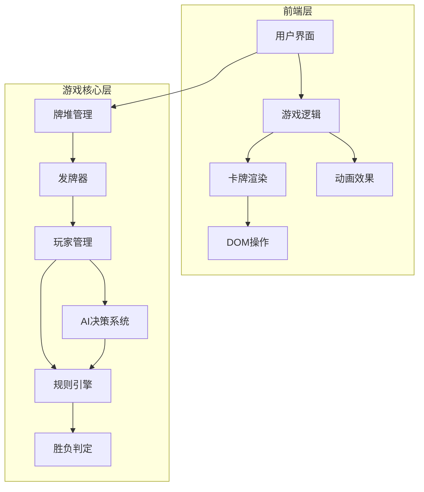

# 掼蛋纸牌游戏技术方案

需求名称：guandan-card-game
更新日期：2026-03-06

## 描述

根据"掼蛋"游戏规则,设计网页端纸牌游戏。掼蛋是一种流行于中国的扑克牌游戏,通常由4人两副牌(共108张)进行,分为两队对抗。本项目实现单机版本,1个人类玩家对战3个AI对手。

## 概述

### 目标

开发一个功能完整、用户体验良好的掼蛋单机游戏,支持完整的掼蛋游戏规则,提供流畅的卡牌动画效果和直观的规则说明界面。

### 范围

- 单机游戏模式(1个真人玩家 + 3个AI玩家)
- 完整的掼蛋游戏规则实现
- 游戏帮助和规则说明系统
- 游戏存档功能
- 响应式界面设计

### 不包含

- 网络对战功能
- AI难度调节(固定难度)
- 排行榜和社交功能

## 架构

### 系统层次结构



### 技术栈选择

- **前端框架**: React 18+
- **状态管理**: Redux Toolkit
- **动画库**: Framer Motion
- **UI组件库**: Material-UI (MUI)
- **构建工具**: Vite
- **TypeScript**: 用于类型安全
- **本地存储**: localStorage API

### 目录结构

```
guandan-card-game/
├── src/
│   ├── components/
│   │   ├── GameRoom/
│   │   │   ├── index.tsx
│   │   │   ├── GameBoard.tsx
│   │   │   ├── PlayerArea.tsx
│   │   │   └── ScoreBoard.tsx
│   │   ├── Card/
│   │   │   ├── index.tsx
│   │   │   └── CardBack.tsx
│   │   ├── Help/
│   │   │   ├── index.tsx
│   │   │   ├── HelpModal.tsx
│   │   │   └── RuleSection.tsx
│   │   └── Settings/
│   │       ├── index.tsx
│   │       └── SettingsMenu.tsx
│   ├── store/
│   │   ├── index.ts
│   │   ├── gameSlice.ts
│   │   ├── playerSlice.ts
│   │   └── cardSlice.ts
│   ├── game/
│   │   ├── engine/
│   │   │   ├── rules.ts
│   │   │   ├── cardTypes.ts
│   │   │   └── validator.ts
│   │   ├── ai/
│   │   │   ├── decision.ts
│   │   │   └── strategy.ts
│   │   ├── utils/
│   │   │   ├── deck.ts
│   │   │   ├── shuffle.ts
│   │   │   └── scoring.ts
│   │   └── constants.ts
│   ├── hooks/
│   │   ├── useGame.ts
│   │   └── useAnimation.ts
│   ├── types/
│   │   ├── card.ts
│   │   ├── player.ts
│   │   └── game.ts
│   ├── utils/
│   │   └── storage.ts
│   ├── App.tsx
│   └── main.tsx
├── public/
│   ├── images/
│   └── sounds/
├── index.html
├── package.json
├── tsconfig.json
└── vite.config.ts
```

## 组件与接口

### 核心组件

#### GameRoom
游戏房间主组件,负责整体游戏流程控制。

**Props:**
```typescript
interface GameRoomProps {
  gameId: string;
  onSave?: () => void;
  onLoad?: () => void;
}
```

**职责:**
- 管理游戏生命周期(开始、暂停、结束)
- 协调子组件间的通信
- 处理键盘快捷键
- 显示游戏状态提示

#### PlayerArea
玩家手牌显示区域,分为4个方位(下、左、上、右)。

**Props:**
```typescript
interface PlayerAreaProps {
  player: Player;
  position: 'bottom' | 'left' | 'top' | 'right';
  isCurrentPlayer: boolean;
  onCardSelect: (cardId: string) => void;
}
```

**职责:**
- 显示玩家手牌
- 处理卡牌选择
- 显示玩家信息(姓名、分数)
- 标记当前出牌玩家

#### Card
单张卡牌组件,支持正反面显示。

**Props:**
```typescript
interface CardProps {
  card: Card;
  isFaceUp: boolean;
  isSelected?: boolean;
  onSelect?: () => void;
  animation?: AnimationConfig;
}
```

**职责:**
- 渲染卡牌正面或背面
- 处理点击选择
- 应用动画效果
- 显示特殊卡牌标识(如级牌、红心)

#### GameBoard
出牌区域,显示当前回合出的牌。

**Props:**
```typescript
interface GameBoardProps {
  playedCards: PlayedCard[];
  lastPlay: PlayResult | null;
}
```

**职责:**
- 显示每位玩家出的牌
- 显示牌型标识
- 动画效果(出牌、收牌)

#### ScoreBoard
计分板,显示两队得分。

**Props:**
```typescript
interface ScoreBoardProps {
  team1Score: number;
  team2Score: number;
  round: number;
  trump: CardRank;
}
```

**职责:**
- 显示当前分数
- 显示回合数
- 显示当前级牌和主牌花色

#### Timer
倒计时器,显示当前玩家思考时间。

**Props:**
```typescript
interface TimerProps {
  timeLeft: number;
  maxTime: number;
  isRunning: boolean;
}
```

**职责:**
- 显示倒计时
- 超时自动出牌
- 视觉提示(变色、动画)

### 帮助系统组件

#### GameHelp
游戏帮助入口按钮。

**职责:**
- 触发帮助弹窗
- 显示快捷提示
- 提供规则索引

#### HelpModal
规则说明弹窗组件。

**Props:**
```typescript
interface HelpModalProps {
  isOpen: boolean;
  onClose: () => void;
  initialSection?: string;
}
```

**职责:**
- 显示规则章节
- 支持目录导航
- 提供搜索功能
- 记住阅读位置

#### RuleSection
规则章节展示组件。

**Props:**
```typescript
interface RuleSectionProps {
  sectionId: string;
  title: string;
  content: React.ReactNode;
  examples?: ExampleData[];
}
```

**职责:**
- 渲染规则内容
- 显示示例图片/动画
- 提供术语解释

#### TermTooltip
术语解释提示组件。

**Props:**
```typescript
interface TermTooltipProps {
  term: string;
  definition: string;
  children: React.ReactNode;
}
```

**职责:**
- 鼠标悬停显示术语解释
- 提供详细说明链接

#### QuickTip
快捷提示组件。

**Props:**
```typescript
interface QuickTipProps {
  message: string;
  type: 'info' | 'warning' | 'success';
  duration?: number;
}
```

**职责:**
- 显示实时游戏提示
- 自动消失
- 支持手动关闭

### 设置组件

#### SettingsMenu
游戏设置菜单。

**Props:**
```typescript
interface SettingsMenuProps {
  isOpen: boolean;
  onClose: () => void;
}
```

**职责:**
- 音效开关
- 动画速度调节
- 快捷键设置
- 清除游戏存档

## 数据模型

### 卡牌数据结构

```typescript
enum Suit {
  SPADES = 'spades',      // 黑桃
  HEARTS = 'hearts',      // 红桃
  DIAMONDS = 'diamonds',  // 方块
  CLUBS = 'clubs',        // 梅花
}

enum CardRank {
  TWO = 2, THREE, FOUR, FIVE, SIX, SEVEN, EIGHT, NINE, TEN,
  JACK = 11, QUEEN = 12, KING = 13, ACE = 14,
  SMALL_JOKER = 15, BIG_JOKER = 16
}

interface Card {
  id: string;
  suit: Suit;
  rank: CardRank;
  value: number;          // 用于比较大小
  isTrump: boolean;       // 是否为主牌
  isRedHeart?: boolean;   // 是否为红心级牌(逢人配)
}
```

### 牌型定义

```typescript
enum CardType {
  SINGLE = 'single',           // 单张
  PAIR = 'pair',               // 对子
  TRIPLE = 'triple',           // 三张
  TRIPLE_WITH_TWO = 'triple_with_two',  // 三带二
  STRAIGHT = 'straight',       // 顺子(5张以上)
  PAIR_STRAIGHT = 'pair_straight',  // 连对(3对以上)
  BOMB = 'bomb',               // 炸弹(4张)
  ROCKET = 'rocket',           // 王炸(2张王)
  STRAIGHT_FLUSH = 'straight_flush',  // 同花顺
  GUANDAN = 'guandan'          // 掼蛋(特殊)
}

interface CardCombination {
  type: CardType;
  cards: Card[];
  rank: number;                // 牌力等级
  length?: number;             // 顺子/连对长度
}

interface PlayResult {
  combination: CardCombination;
  playerId: string;
  isValid: boolean;
  isPass: boolean;
}
```

### 玩家数据结构

```typescript
interface Player {
  id: string;
  name: string;
  hand: Card[];
  team: 1 | 2;                 // 队伍编号
  isHuman: boolean;            // 是否为人类玩家
  position: 'south' | 'west' | 'north' | 'east';
  stats: {
    wins: number;
    losses: number;
    totalGames: number;
  };
}
```

### 游戏状态

```typescript
interface GameState {
  // 基础信息
  gameId: string;
  status: 'waiting' | 'dealing' | 'playing' | 'finished';
  currentRound: number;
  trumpRank: CardRank;         // 当前级牌
  trumpSuit: Suit | null;      // 主牌花色(出牌后确定)

  // 玩家状态
  players: Player[];
  currentPlayerIndex: number;
  teamScores: [number, number];  // [队伍1得分, 队伍2得分]

  // 回合状态
  currentTurn: {
    playerId: string;
    startTime: number;
    isThinking: boolean;
  };

  // 出牌状态
  playedCards: {
    playerId: string;
    cards: Card[];
    combination: CardCombination | null;
  }[];

  // 历史记录
  playHistory: PlayResult[];
  lastValidPlay: PlayResult | null;

  // 特殊状态
  isGonging: boolean;          // 是否在进贡阶段
  gongCards: {
    fromPlayer: string;
    toPlayer: string;
    card: Card;
  }[];
}
```

### AI决策数据

```typescript
interface AIDecision {
  action: 'play' | 'pass';
  cards: Card[];              // 要出的牌
  confidence: number;          // 决策置信度
  reasoning: string;           // 决策理由
}

interface AIState {
  memory: {
    playedCards: Card[];
    player tendencies: Map<string, number>;
  };
  currentStrategy: 'aggressive' | 'conservative' | 'balanced';
}
```

### 存档数据

```typescript
interface SaveData {
  version: string;
  timestamp: number;
  gameState: GameState;
  aiStates: Map<string, AIState>;
}
```

## 正确性属性

### 游戏规则正确性

1. **卡牌生成**: 每副牌52张(不含大小王),两副牌共104张,加上4张大小王共108张
2. **发牌规则**: 每人发27张,确保牌数正确
3. **牌型判断**: 准确识别所有合法牌型,包括特殊牌型
4. **大小比较**: 正确比较不同牌型的大小关系,遵循掼蛋规则
5. **进贡规则**: 胜者需要向败者进贡最大牌
6. **级牌规则**: 级牌作为主牌,大小王为最大主牌
7. **逢人配**: 红心级牌可作为任意牌使用

### 状态一致性

1. **玩家手牌**: 手牌总数始终为27张(出牌/吃牌后更新)
2. **牌堆状态**: 发牌后牌堆为空,无牌可出时游戏结束
3. **回合顺序**: 严格按照逆时针顺序轮流出牌
4. **得分计算**: 准确计算每队得分,胜者晋升一级
5. **存档恢复**: 存档和读档后游戏状态完全一致

### AI行为正确性

1. **出牌合法性**: AI只能出合法牌型
2. **策略一致性**: AI决策符合当前策略和局势
3. **时间限制**: AI在规定时间内完成决策(可配置)

## 错误处理

### 用户输入错误

1. **非法出牌**: 提示用户牌型不合法,阻止出牌
2. **超时未出**: 自动出最小合法牌或自动过牌
3. **手牌不足**: 提示用户无法完成操作

### 系统错误

1. **存档损坏**: 提示存档无法读取,删除损坏存档
2. **动画失败**: 降级为无动画模式,记录错误日志
3. **音效加载失败**: 静默处理,不影响游戏进行

### AI错误

1. **决策超时**: 强制AI随机选择合法出牌
2. **无合法牌**: 自动过牌
3. **状态异常**: 重置AI状态,从当前状态重新决策

### 错误处理策略

```typescript
class GameErrorHandler {
  handleInvalidPlay(error: InvalidPlayError) {
    // 显示友好错误提示
    showNotification(error.message, 'error');
    // 记录错误日志
    logError(error);
    // 恢复游戏状态
    revertGameState();
  }

  handleSaveError(error: SaveError) {
    // 通知用户保存失败
    showNotification('游戏存档失败', 'warning');
    // 提供重试选项
    offerRetry();
  }

  handleAIError(error: AIError) {
    // 回退到安全模式
    useSafeMode();
    // 记录AI错误
    logAIError(error);
    // 尝试恢复
    attemptRecovery();
  }
}
```

## 测试策略

### 单元测试

1. **规则引擎测试**
   - 牌型识别函数测试
   - 牌力比较函数测试
   - 进贡规则测试
   - 边界条件测试

2. **AI决策测试**
   - 决策逻辑正确性
   - 策略切换测试
   - 性能测试(决策时间)

3. **工具函数测试**
   - 洗牌算法测试
   - 发牌逻辑测试
   - 得分计算测试

### 集成测试

1. **游戏流程测试**
   - 完整游戏流程测试
   - 存档/读档测试
   - 状态同步测试

2. **组件交互测试**
   - 用户交互测试
   - 组件通信测试
   - 状态更新测试

### 端到端测试

1. **游戏场景测试**
   - 常见出牌场景
   - 特殊牌型场景
   - 进贡场景
   - 胜负判定场景

2. **用户体验测试**
   - 帮助系统可用性
   - 动画流畅度
   - 响应性测试

### 测试覆盖率目标

- 规则引擎: ≥95%
- AI决策: ≥90%
- 工具函数: ≥90%
- 组件逻辑: ≥80%
- 整体覆盖率: ≥85%

## 游戏帮助和规则说明

### 帮助系统功能

1. **规则说明界面**: 分章节展示掼蛋游戏规则
   - 基本规则(牌数、组队、目标)
   - 卡牌大小规则
   - 牌型介绍(单张、对子、三带二、顺子、连对、炸弹等)
   - 进贡规则
   - 游戏流程说明

2. **图文教程**: 使用示例图片和动画演示游戏玩法

3. **快捷提示**: 游戏中的实时规则提示和建议

4. **术语解释**: 掼蛋专业术语的说明

### 规则文档结构

```
├── 基础规则
│   ├── 玩家配置(4人2队)
│   ├── 卡牌配置(2副牌108张)
│   └── 游戏目标(先出完牌获胜)
├── 牌型与大小
│   ├── 单张
│   ├── 对子、三张、三带二
│   ├── 顺子、连对
│   ├── 炸弹、王炸
│   └── 同花顺、掼蛋
├── 特殊规则
│   ├── 进贡规则
│   ├── 红心级牌规则
│   └── 逢人配规则
└── 游戏流程
    ├── 发牌阶段
    ├── 出牌阶段
    ├── 回合规则
    └── 结算阶段
```

### 规则详细说明

#### 基础规则

**玩家配置**
- 4名玩家分为两队,每队2人
- 坐位相对的玩家为队友
- 队伍1: 南北方位(玩家1和玩家3)
- 队伍2: 东西方位(玩家2和玩家4)

**卡牌配置**
- 使用两副完整扑克牌,共108张
- 每副牌52张(不含大小王)
- 4张大小王(2张小王,2张大王)
- 级牌从2开始,胜者晋升一级,最高为A级

**游戏目标**
- 每局游戏中,先出完牌的一方获胜
- 胜者队伍晋级一级
- 败者需要向胜者进贡
- 先达到A级获胜的队伍为最终赢家

#### 牌型与大小

**牌型大小顺序**(从大到小):
1. 王炸(2张王) > 任何炸弹
2. 掼蛋(特殊牌型) > 王炸
3. 同花顺 > 炸弹
4. 炸弹(4张及以上) > 非炸弹牌型
5. 炸弹大小按牌点数比较
6. 同类型牌型按最大牌比较

**卡牌大小顺序**(从大到小):
- 大王 > 小王 > 主牌级牌 > 主牌花色的级牌 > A > K > Q > ... > 2
- 级牌和主牌花色的级牌可以作为主牌使用

#### 特殊规则

**进贡规则**
- 每局开始前,败者向胜者进贡
- 进贡牌为败者手中最大的牌
- 胜者选择一张牌还给败者
- 如果双方同分,则不进贡

**红心级牌规则**
- 级牌为红心的,可作为任意牌使用
- 只能作为辅助牌,不能单独使用
- 不影响牌型判断

**逢人配规则**
- 红心级牌可以搭配任意牌型
- 可以提高牌型大小
- 使用时需提示对方

#### 游戏流程

**发牌阶段**
1. 洗牌: 打乱两副牌
2. 发牌: 每人发27张
3. 进贡: 根据上一局结果进行进贡
4. 定主: 第一个出牌的花色为主牌花色

**出牌阶段**
1. 第一个出牌的玩家出任意合法牌型
2. 其他玩家必须出相同类型且更大的牌
3. 无法出牌时选择"过"
4. 其他三家都过后,出牌最大者获得下一轮出牌权

**回合规则**
1. 逆时针顺序轮流出牌
2. 每次出牌时间为30秒
3. 超时自动出最小牌或过牌
4. 一方出完牌后游戏结束

**结算阶段**
1. 计算双方得分
2. 胜者队伍晋级
3. 更新玩家统计
4. 保存游戏记录

## 实现要点

1. **游戏规则引擎**: 实现掼蛋的核心规则判断逻辑
2. **AI对手**: 实现3个AI玩家与1个人类玩家的对战,固定中等难度
3. **单机模式**: 所有逻辑在本地运行,无需服务器
4. **动画效果**: 使用Framer Motion实现流畅的卡牌动画
5. **音效反馈**: 游戏过程中的音效提示(出牌、胜利、失败等)
6. **响应式设计**: 适配桌面端和移动端,使用Flexbox和Grid布局
7. **游戏存档**: 使用localStorage存储游戏进度,支持暂停和继续
8. **游戏帮助**: 提供详细的掼蛋规则说明和教程,支持搜索和导航
9. **设置选项**: 音效开关、动画速度、快捷键等自定义设置

## 开发计划

### 第一阶段: 基础框架(1-2周)
- 项目初始化
- 基础组件开发
- Redux状态管理搭建
- 卡牌组件和渲染

### 第二阶段: 游戏逻辑(2-3周)
- 规则引擎开发
- 牌型识别和判断
- 得分计算
- 进贡逻辑

### 第三阶段: AI系统(2-3周)
- AI决策算法
- 策略系统
- 状态记忆

### 第四阶段: 界面完善(1-2周)
- 动画效果
- 帮助系统
- 设置菜单
- 响应式适配

### 第五阶段: 测试优化(1周)
- 单元测试
- 集成测试
- 性能优化
- Bug修复

## 引用链接

[^1]: 掼蛋游戏规则 - https://zh.wikipedia.org/wiki/掼蛋
