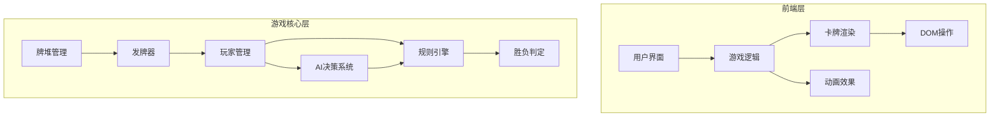

# 掼蛋纸牌游戏技术方案

需求名称：guandan-card-game
更新日期：2026-03-06

## 描述

根据"掼蛋"游戏规则,设计网页端纸牌游戏。掼蛋是一种流行于中国的扑克牌游戏,通常由4人两副牌(共108张)进行,分为两队对抗。

## 架构

### 系统层次结构



### 技术栈选择

- **前端框架**: React
- **状态管理**: Redux Toolkit / Context API
- **动画库**: Framer Motion / CSS Transitions
- **UI组件**: Material-UI / Ant Design / 自定义组件

## 组件和接口

### 核心组件

1. **GameRoom**: 游戏房间主组件
2. **PlayerArea**: 玩家手牌显示区域
3. **Card**: 单张卡牌组件
4. **GameBoard**: 出牌区域
5. **ScoreBoard**: 计分板
6. **Timer**: 倒计时器
7. **GameHelp**: 游戏帮助和规则说明
8. **SettingsMenu**: 游戏设置菜单

### 帮助系统组件

1. **HelpModal**: 规则说明弹窗
2. **RuleSection**: 规则章节展示
3. **TermTooltip**: 术语解释提示
4. **QuickTip**: 快捷提示组件

### 数据接口

```typescript
interface Card {
    suit: 'spades' | 'hearts' | 'diamonds' | 'clubs';
    rank: number;
    value: number;
}

interface Player {
    id: string;
    name: string;
    hand: Card[];
    team: number;
}

interface GameState {
    currentPlayer: string;
    trumpSuit: string;
    trumpRank: number;
    lastPlayedCards: Card[];
    scores: { team1: number; team2: number };
}
```

## 数据结构

### 游戏状态管理

- 玩家手牌数据结构
- 出牌历史记录
- 游戏分数统计
- 回合状态信息
- 牌堆初始化和洗牌算法

### 牌型定义

- 单张
- 对子
- 三张
- 三带二
- 顺子
- 连对
- 炸弹
- 王炸
- 同花顺
- 掼蛋(特殊牌型)

## 实现要点

1. **游戏规则引擎**: 实现掼蛋的核心规则判断逻辑
2. **AI对手**: 实现3个AI玩家与1个人类玩家的对战,支持不同难度级别
3. **单机模式**: 所有逻辑在本地运行,无需服务器
4. **动画效果**: 卡牌出牌、收牌、移动的流畅动画
5. **音效反馈**: 游戏过程中的音效提示
6. **响应式设计**: 适配不同屏幕尺寸
7. **游戏存档**: 支持本地存储游戏进度,可暂停和继续游戏
8. **游戏帮助**: 提供详细的掼蛋规则说明和教程
9. **设置选项**: 音效开关、难度选择、动画速度等自定义设置

## 游戏帮助和规则说明

### 帮助系统功能

1. **规则说明界面**: 分章节展示掼蛋游戏规则
   - 基本规则(牌数、组队、目标)
   - 卡牌大小规则
   - 牌型介绍(单张、对子、三带二、顺子、连对、炸弹等)
   - 进贡规则
   - 游戏流程说明

2. **图文教程**: 使用示例图片和动画演示游戏玩法

3. **快捷提示**: 游戏中的实时规则提示和建议

4. **术语解释**: 掼蛋专业术语的说明

### 规则文档结构

```
├── 基础规则
│   ├── 玩家配置(4人2队)
│   ├── 卡牌配置(2副牌108张)
│   └── 游戏目标(先出完牌获胜)
├── 牌型与大小
│   ├── 单张
│   ├── 对子、三张、三带二
│   ├── 顺子、连对
│   ├── 炸弹、王炸
│   └── 同花顺、掼蛋
├── 特殊规则
│   ├── 进贡规则
│   ├── 红心级牌规则
│   └── 逢人配规则
└── 游戏流程
    ├── 发牌阶段
    ├── 出牌阶段
    ├── 回合规则
    └── 结算阶段
```

## 引用链接

[^1]: 掼蛋游戏规则 - https://zh.wikipedia.org/wiki/掼蛋
